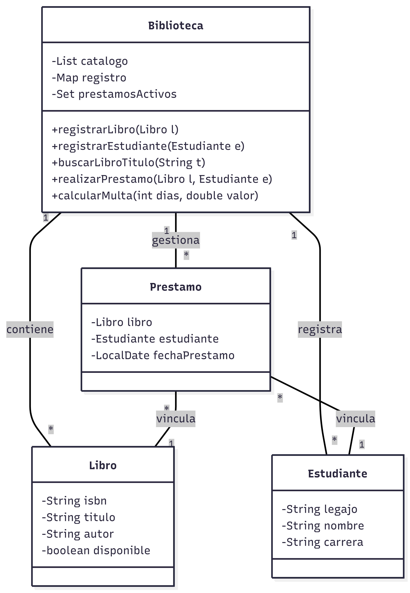

# Sistema de Gestión de Biblioteca Universitaria - UNLaR

Este proyecto es el desarrollo del **Trabajo Práctico Nº 1.1** para la cátedra de **Programación III**. Consiste en un sistema de gestión bibliotecaria que aplica conceptos de Programación Orientada a Objetos, manejo de colecciones y recursividad.

## 👥 Integrantes
* **Bruno Sebastian Sandoval** - Ingeniería en Sistemas de Información (UNLaR)
* **Valentino Lemor** - Ingeniería en Sistemas de Información (UNLaR)
diagrama de clases del Sistema:
  
